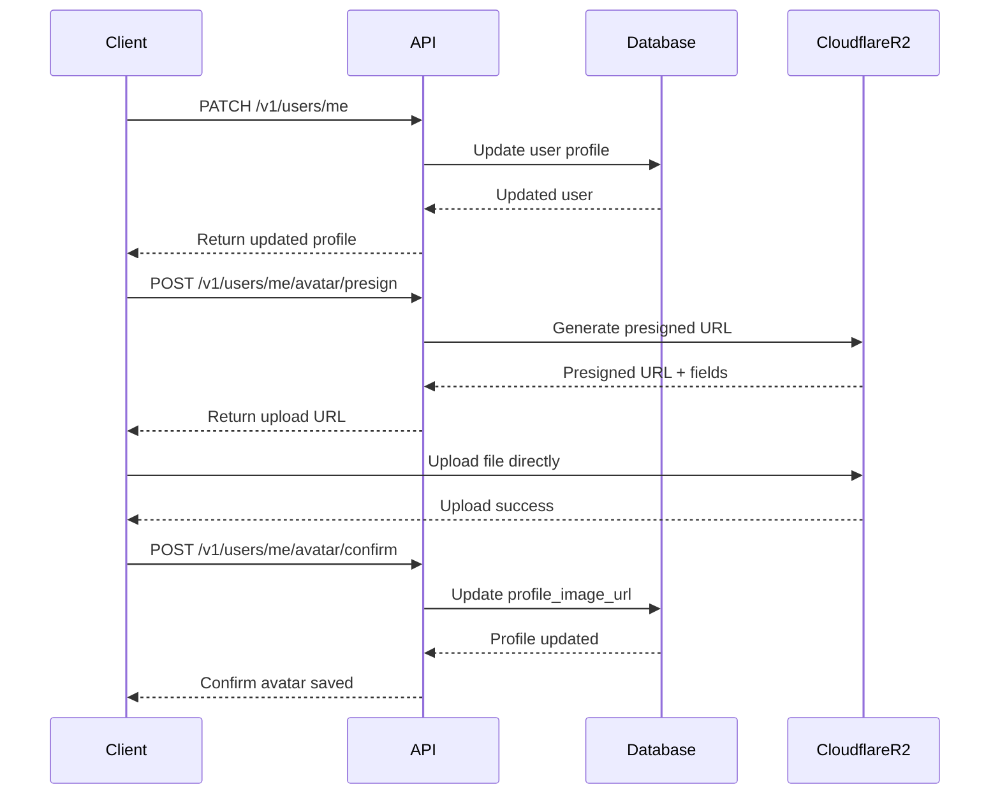

# Luồng User Management - Carden API

## Tổng quan

Quản lý thông tin cá nhân người dùng, cài đặt TTS, và upload avatar.

## 1. Lấy thông tin profile hiện tại

### Endpoint: `GET /v1/users/me`

#### Headers:
```
Authorization: Bearer <access_token>
```

#### Response (200 OK):
```json
{
  "success": true,
  "data": {
    "id": 1,
    "username": "johndoe2024",
    "email": "john.doe@example.com",
    "displayName": "John Doe",
    "profileImageUrl": "https://r2.example.com/avatars/user-1-avatar.jpg",
    "role": "USER",
    "isActive": true,
    "emailVerified": true,
    "lastLogin": "2024-01-15T10:30:00Z",
    "timezone": "Asia/Ho_Chi_Minh",
    "uiLanguage": "vi",
    "learningGoalCardsPerDay": 25,
    "createdAt": "2024-01-01T00:00:00Z",
    "updatedAt": "2024-01-15T10:30:00Z"
  }
}
```

## 2. Cập nhật thông tin profile

### Endpoint: `PATCH /v1/users/me`

#### Headers:
```
Authorization: Bearer <access_token>
Content-Type: application/json
```

#### Request Body:
```json
{
  "displayName": "John Doe Updated",
  "timezone": "Asia/Ho_Chi_Minh",
  "uiLanguage": "EN",
  "learningGoalCardsPerDay": 30
}
```

#### Response (200 OK):
```json
{
  "success": true,
  "data": {
    "id": 1,
    "username": "johndoe2024",
    "email": "john.doe@example.com",
    "displayName": "John Doe Updated",
    "profileImageUrl": "https://r2.example.com/avatars/user-1-avatar.jpg",
    "role": "USER",
    "isActive": true,
    "emailVerified": true,
    "lastLogin": "2024-01-15T10:30:00Z",
    "timezone": "Asia/Ho_Chi_Minh",
    "uiLanguage": "en",
    "learningGoalCardsPerDay": 30,
    "createdAt": "2024-01-01T00:00:00Z",
    "updatedAt": "2024-01-15T11:00:00Z"
  }
}
```

## 3. Quản lý TTS Settings

### 3.1 Lấy cài đặt TTS

#### Endpoint: `GET /v1/users/me/tts-settings`

#### Headers:
```
Authorization: Bearer <access_token>
```

#### Response (200 OK):
```json
{
  "success": true,
  "data": {
    "ttsEnabled": true,
    "preferredVoice": "en-US-Neural2-J",
    "speechRate": 1.0,
    "speechPitch": 1.0,
    "speechVolume": 0.8
  }
}
```

### 3.2 Cập nhật cài đặt TTS

#### Endpoint: `PATCH /v1/users/me/tts-settings`

#### Headers:
```
Authorization: Bearer <access_token>
Content-Type: application/json
```

#### Request Body:
```json
{
  "ttsEnabled": true,
  "preferredVoice": "en-US-Neural2-F",
  "speechRate": 1.2,
  "speechPitch": 0.9,
  "speechVolume": 0.7
}
```

#### Response (200 OK):
```json
{
  "success": true,
  "data": {
    "ttsEnabled": true,
    "preferredVoice": "en-US-Neural2-F",
    "speechRate": 1.2,
    "speechPitch": 0.9,
    "speechVolume": 0.7
  }
}
```

## 4. Upload Avatar

### 4.1 Upload trực tiếp (Server-side)

#### Endpoint: `POST /v1/users/me/avatar`

#### Headers:
```
Authorization: Bearer <access_token>
Content-Type: multipart/form-data
```

#### Request Body (Form Data):
```
file: <image_file> (PNG/JPEG/GIF, max 5MB)
```

#### Response (200 OK):
```json
{
  "success": true,
  "message": "Uploaded",
  "data": "https://r2.example.com/avatars/user-1-avatar-20240115.jpg"
}
```

### 4.2 Upload với Presigned URL (Client-side)

#### Step 1: Lấy Presigned URL

##### Endpoint: `POST /v1/users/me/avatar/presign`

##### Headers:
```
Authorization: Bearer <access_token>
```

##### Request Body:
```json
{
  "contentType": "image/jpeg"
}
```

##### Response (200 OK):
```json
{
  "success": true,
  "data": {
    "uploadUrl": "https://r2.cloudflare.com/bucket/presigned-upload-url",
    "publicUrl": "https://r2.example.com/avatars/user-1-avatar-temp.jpg",
    "expiresIn": 3600,
    "fields": {
      "key": "avatars/user-1-avatar-temp.jpg",
      "Content-Type": "image/jpeg"
    }
  }
}
```

#### Step 2: Upload file lên Cloudflare R2
```bash
# Client tự upload lên uploadUrl
curl -X POST "https://r2.cloudflare.com/bucket/presigned-upload-url" \
  -F "key=avatars/user-1-avatar-temp.jpg" \
  -F "Content-Type=image/jpeg" \
  -F "file=@/path/to/avatar.jpg"
```

#### Step 3: Xác nhận upload

##### Endpoint: `POST /v1/users/me/avatar/confirm`

##### Headers:
```
Authorization: Bearer <access_token>
```

##### Request Body:
```json
{
  "publicUrl": "https://r2.example.com/avatars/user-1-avatar-temp.jpg"
}
```

##### Response (200 OK):
```json
{
  "success": true,
  "message": "Avatar confirmed",
  "data": "https://r2.example.com/avatars/user-1-avatar-temp.jpg"
}
```

## 5. Validation Rules

### Profile Update:
- **displayName**: Tùy chọn, tối đa 100 ký tự
- **timezone**: IANA timezone (ví dụ: "Asia/Ho_Chi_Minh", "UTC")
- **uiLanguage**: "en" hoặc "vi"
- **learningGoalCardsPerDay**: Số nguyên từ 1-100

### TTS Settings:
- **ttsEnabled**: boolean
- **preferredVoice**: String (voice engine name)
- **speechRate**: 0.5 - 2.0
- **speechPitch**: 0.5 - 2.0  
- **speechVolume**: 0.0 - 1.0

### Avatar Upload:
- **File types**: PNG, JPEG, GIF
- **File size**: Tối đa 5MB
- **Dimensions**: Khuyến nghị vuông (1:1 ratio)

## 6. Error Responses

### 400 Bad Request - Invalid timezone:
```json
{
  "success": false,
  "message": "Invalid timezone",
  "timestamp": "2024-01-15T10:30:00Z"
}
```

### 400 Bad Request - File quá lớn:
```json
{
  "success": false,
  "message": "File size exceeds limit of 5MB",
  "timestamp": "2024-01-15T10:30:00Z"
}
```

### 422 Validation Error:
```json
{
  "success": false,
  "message": "Validation failed",
  "errors": [
    {
      "field": "speechRate",
      "message": "Speech rate must be between 0.5 and 2.0"
    }
  ],
  "timestamp": "2024-01-15T10:30:00Z"
}
```

## 7. Test Cases cho Swagger UI

### Test Case 1: Update profile thành công
```json
{
  "displayName": "Jane Smith",
  "timezone": "America/New_York",
  "uiLanguage": "en",
  "learningGoalCardsPerDay": 20
}
```

### Test Case 2: Update profile với timezone không hợp lệ
```json
{
  "timezone": "Invalid/Timezone",
  "uiLanguage": "en"
}
```

### Test Case 3: Update TTS settings
```json
{
  "ttsEnabled": true,
  "preferredVoice": "vi-VN-HoaiMyNeural",
  "speechRate": 0.8,
  "speechPitch": 1.1,
  "speechVolume": 0.9
}
```

### Test Case 4: Disable TTS
```json
{
  "ttsEnabled": false,
  "speechRate": 1.0,
  "speechPitch": 1.0,
  "speechVolume": 1.0
}
```

### Test Case 5: Presigned URL request
```json
{
  "contentType": "image/png"
}
```

### Test Case 6: Avatar confirm
```json
{
  "publicUrl": "https://r2.example.com/avatars/user-123-avatar-20240115.png"
}
```

## 8. Workflow tổng thể



## 9. Các lưu ý quan trọng

1. **Timezone Support**: Hệ thống hỗ trợ đầy đủ IANA timezone identifiers
2. **Avatar Storage**: Sử dụng Cloudflare R2 cho storage, có 2 phương thức upload
3. **TTS Integration**: Hỗ trợ đa dạng voice engines từ các nhà cung cấp
4. **Partial Updates**: Tất cả PATCH endpoints hỗ trợ partial update
5. **Profile Image**: Automatically resize và optimize ở backend khi cần
6. **Language Support**: UI language ảnh hưởng đến full-text search trong cards
