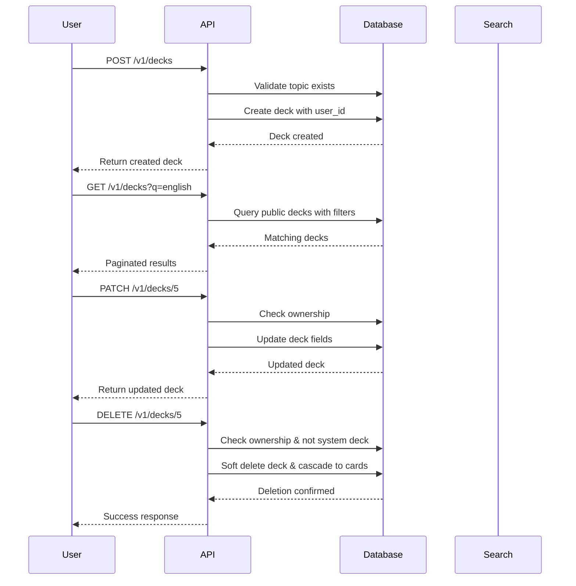

# Luồng Deck Management - Carden API

## Tổng quan

Quản lý bộ thẻ học: tạo mới, tìm kiếm, cập nhật, và xóa. Bao gồm cả public marketplace và private decks.

## 1. Tạo Deck mới

### Endpoint: `POST /v1/decks`

#### Headers:
```
Authorization: Bearer <access_token>
Content-Type: application/json
```

#### Request Body:
```json
{
  "title": "Essential English Vocabulary",
  "description": "Common English words for beginners",
  "topicId": 1,
  "cefrLevel": "A2",
  "sourceLanguage": "en",
  "targetLanguage": "vi",
  "tags": ["english", "basic", "vocabulary"],
  "coverImageUrl": "https://example.com/covers/english-vocab.jpg"
}
```

#### Response (200 OK):
```json
{
  "success": true,
  "message": "Deck created",
  "data": {
    "id": 5,
    "title": "Essential English Vocabulary",
    "description": "Common English words for beginners",
    "visibility": "PRIVATE",
    "cefrLevel": "A2",
    "sourceLanguage": "en",
    "targetLanguage": "vi",
    "coverImageUrl": "https://example.com/covers/english-vocab.jpg",
    "tags": ["english", "basic", "vocabulary"],
    "isSystemDeck": false,
    "downloadCount": 0,
    "likeCount": 0,
    "cardCount": 0,
    "topic": {
      "id": 1,
      "name": "English Vocabulary",
      "description": "English vocabulary topics"
    },
    "user": {
      "id": 1,
      "username": "johndoe2024",
      "displayName": "John Doe"
    },
    "createdAt": "2024-01-15T10:30:00Z",
    "updatedAt": "2024-01-15T10:30:00Z"
  }
}
```

## 2. Tìm kiếm Public Decks (Marketplace)

### Endpoint: `GET /v1/decks`

#### Query Parameters:
- `q`: Từ khóa tìm kiếm (title, description)
- `topicId`: Lọc theo chủ đề
- `cefr`: Lọc theo CEFR level
- `page`: Trang (bắt đầu từ 0)
- `size`: Số items per page
- `sort`: Sắp xếp

#### Example Request:
```
GET /v1/decks?q=english&topicId=1&cefr=A2&page=0&size=10&sort=title,asc
```

#### Response (200 OK):
```json
{
  "success": true,
  "data": {
    "content": [
      {
        "id": 2,
        "title": "English for Beginners",
        "description": "Basic English vocabulary and phrases",
        "visibility": "PUBLIC",
        "cefrLevel": "A1",
        "sourceLanguage": "en",
        "targetLanguage": "vi",
        "coverImageUrl": "https://example.com/covers/english-beginners.jpg",
        "tags": ["english", "beginner"],
        "isSystemDeck": true,
        "downloadCount": 150,
        "likeCount": 45,
        "cardCount": 100,
        "topic": {
          "id": 1,
          "name": "English Vocabulary"
        },
        "user": {
          "id": null,
          "username": "system",
          "displayName": "System"
        },
        "createdAt": "2024-01-01T00:00:00Z",
        "updatedAt": "2024-01-10T12:00:00Z"
      }
    ],
    "pageable": {
      "pageNumber": 0,
      "pageSize": 10,
      "sort": {
        "sorted": true,
        "orders": [
          {
            "property": "title",
            "direction": "ASC"
          }
        ]
      }
    },
    "totalElements": 1,
    "totalPages": 1,
    "first": true,
    "last": true,
    "numberOfElements": 1
  }
}
```

## 3. Tìm kiếm My Decks (Decks của user)

### Endpoint: `GET /v1/decks/me`

#### Headers:
```
Authorization: Bearer <access_token>
```

#### Query Parameters: (giống như public search)
```
GET /v1/decks/me?q=vocabulary&page=0&size=10&sort=updatedAt,desc
```

#### Response (200 OK):
```json
{
  "success": true,
  "data": {
    "content": [
      {
        "id": 5,
        "title": "Essential English Vocabulary",
        "description": "Common English words for beginners",
        "visibility": "PRIVATE",
        "cefrLevel": "A2",
        "sourceLanguage": "en",
        "targetLanguage": "vi",
        "coverImageUrl": "https://example.com/covers/english-vocab.jpg",
        "tags": ["english", "basic", "vocabulary"],
        "isSystemDeck": false,
        "isPublic": false,
        "downloadCount": 0,
        "likeCount": 0,
        "cardCount": 15,
        "topic": {
          "id": 1,
          "name": "English Vocabulary"
        },
        "user": {
          "id": 1,
          "username": "johndoe2024",
          "displayName": "John Doe"
        },
        "createdAt": "2024-01-15T10:30:00Z",
        "updatedAt": "2024-01-15T15:30:00Z"
      }
    ],
    "pageable": {
      "pageNumber": 0,
      "pageSize": 10
    },
    "totalElements": 1,
    "totalPages": 1
  }
}
```

## 4. Lấy chi tiết Deck

### Endpoint: `GET /v1/decks/{id}`

#### Example Request:
```
GET /v1/decks/5
```

#### Response (200 OK):
```json
{
  "success": true,
  "data": {
    "id": 5,
    "title": "Essential English Vocabulary",
    "description": "Common English words for beginners",
    "visibility": "PRIVATE",
    "cefrLevel": "A2",
    "sourceLanguage": "en",
    "targetLanguage": "vi",
    "coverImageUrl": "https://example.com/covers/english-vocab.jpg",
    "tags": ["english", "basic", "vocabulary"],
    "isSystemDeck": false,
    "downloadCount": 0,
    "likeCount": 0,
    "cardCount": 15,
    "topic": {
      "id": 1,
      "name": "English Vocabulary",
      "description": "English vocabulary topics"
    },
    "user": {
      "id": 1,
      "username": "johndoe2024",
      "displayName": "John Doe",
      "profileImageUrl": "https://r2.example.com/avatars/user-1-avatar.jpg"
    },
    "createdAt": "2024-01-15T10:30:00Z",
    "updatedAt": "2024-01-15T15:30:00Z"
  }
}
```

## 5. Cập nhật Deck

### Endpoint: `PATCH /v1/decks/{id}`

#### Headers:
```
Authorization: Bearer <access_token>
Content-Type: application/json
```

#### Request Body (Partial Update):
```json
{
  "title": "Essential English Vocabulary - Updated",
  "description": "Common English words for beginners with examples",
  "visibility": "PUBLIC",
  "tags": ["english", "basic", "vocabulary", "examples"]
}
```

#### Response (200 OK):
```json
{
  "success": true,
  "message": "Deck updated",
  "data": {
    "id": 5,
    "title": "Essential English Vocabulary - Updated",
    "description": "Common English words for beginners with examples",
    "visibility": "PUBLIC",
    "cefrLevel": "A2",
    "sourceLanguage": "en",
    "targetLanguage": "vi",
    "coverImageUrl": "https://example.com/covers/english-vocab.jpg",
    "tags": ["english", "basic", "vocabulary", "examples"],
    "isSystemDeck": false,
    "downloadCount": 0,
    "likeCount": 0,
    "cardCount": 15,
    "topic": {
      "id": 1,
      "name": "English Vocabulary"
    },
    "user": {
      "id": 1,
      "username": "johndoe2024",
      "displayName": "John Doe"
    },
    "createdAt": "2024-01-15T10:30:00Z",
    "updatedAt": "2024-01-15T16:00:00Z"
  }
}
```

## 6. Xóa Deck

### Endpoint: `DELETE /v1/decks/{id}`

#### Headers:
```
Authorization: Bearer <access_token>
```

#### Response (200 OK):
```json
{
  "success": true,
  "message": "Deleted"
}
```

## 7. Validation Rules

### Deck Creation/Update:
- **title**: Bắt buộc, tối đa 200 ký tự
- **description**: Tùy chọn, tối đa 1000 ký tự
- **topicId**: Phải tồn tại trong database
- **cefrLevel**: A1, A2, B1, B2, C1, C2 hoặc null
- **sourceLanguage/targetLanguage**: Mã ngôn ngữ ISO (tối đa 10 ký tự)
- **tags**: Mảng strings, tối đa 10 tags
- **coverImageUrl**: URL hợp lệ, tối đa 500 ký tự
- **visibility**: PRIVATE, PUBLIC, UNLISTED

### Business Rules:
- Chỉ owner hoặc admin mới có thể update/delete deck
- System decks không thể delete
- Khi delete deck, tất cả cards trong deck cũng bị soft delete
- **Visibility Rules**:
  - `PRIVATE`: Chỉ owner mới thấy và search được
  - `PUBLIC`: Hiển thị trong marketplace, search được bởi mọi user
  - `UNLISTED`: Access qua direct link, không hiển thị trong search

## 8. Error Responses

### 403 Forbidden - Không phải owner:
```json
{
  "success": false,
  "message": "Access denied: You can only modify your own decks",
  "timestamp": "2024-01-15T10:30:00Z"
}
```

### 404 Not Found - Deck không tồn tại:
```json
{
  "success": false,
  "message": "Deck not found",
  "timestamp": "2024-01-15T10:30:00Z"
}
```

### 400 Bad Request - Xóa system deck:
```json
{
  "success": false,
  "message": "Cannot delete system deck",
  "timestamp": "2024-01-15T10:30:00Z"
}
```

## 9. Test Cases cho Swagger UI

### Test Case 1: Tạo deck private
```json
{
  "title": "My Personal Vocabulary",
  "description": "Personal collection of words I want to learn",
  "topicId": 1,
  "cefrLevel": "B1",
  "sourceLanguage": "en",
  "targetLanguage": "vi",
  "tags": ["personal", "vocabulary"]
}
```

### Test Case 2: Tạo deck public với cover image
```json
{
  "title": "Business English Terms",
  "description": "Essential vocabulary for business communication",
  "topicId": 2,
  "cefrLevel": "B2",
  "sourceLanguage": "en",
  "targetLanguage": "vi",
  "tags": ["business", "professional", "english"],
  "coverImageUrl": "https://images.unsplash.com/photo-1507003211169-0a1dd7228f2d"
}
```

### Test Case 3: Update deck để public
```json
{
  "visibility": "PUBLIC",
  "description": "Updated description with more details"
}
```

### Test Case 4: Search public decks
```
GET /v1/decks?q=english&cefr=A2&page=0&size=5&sort=downloadCount,desc
```

### Test Case 5: Search my decks
```
GET /v1/decks/me?sort=updatedAt,desc&size=10
```

## 10. Workflow tổng thể



## 11. Các lưu ý quan trọng

1. **Visibility Levels**:
   - `PRIVATE`: Chỉ owner mới thấy
   - `PUBLIC`: Hiển thị trong marketplace
   - `UNLISTED`: Access qua direct link

2. **Search & Pagination**: 
   - Hỗ trợ full-text search cho title và description
   - Pagination với Spring Boot Pageable
   - Multi-sort support

3. **Soft Delete**: 
   - Decks được soft delete (`deleted = true`)
   - Cards trong deck cũng bị cascade soft delete

4. **CEFR Levels**: 
   - Hỗ trợ Common European Framework levels
   - Giúp phân loại độ khó

5. **Tag System**: 
   - JSONB array cho flexibility
   - Hỗ trợ filter và search

6. **Topic Integration**: 
   - Optional categorization
   - Hierarchical topic support
