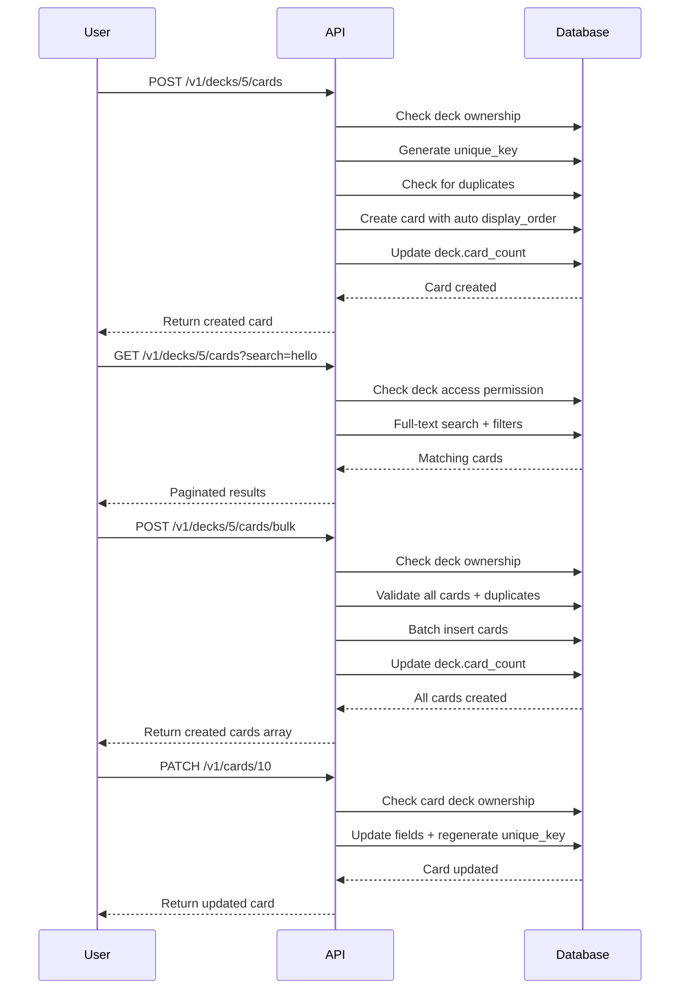

# Luồng Card Management - Carden API

## Tổng quan

Quản lý thẻ học trong deck: tạo mới, tìm kiếm, cập nhật, xóa, và bulk operations.

## 1. Tạo Card mới trong Deck

### Endpoint: `POST /v1/decks/{deckId}/cards`

#### Headers:
```
Authorization: Bearer <access_token>
Content-Type: application/json
```

#### Request Body:
```json
{
  "front": "Hello",
  "back": "Xin chào",
  "ipaPronunciation": "/həˈloʊ/",
  "examples": [
    "Hello, how are you?",
    "She said hello to her friends."
  ],
  "synonyms": ["Hi", "Greetings"],
  "antonyms": ["Goodbye", "Farewell"],
  "tags": ["greeting", "basic"],
  "imageUrl": "https://example.com/images/hello.jpg",
  "audioUrl": "https://example.com/audio/hello.mp3",
  "difficulty": "EASY",
  "displayOrder": 1
}
```

#### Response (201 Created):
```json
{
  "success": true,
  "message": "Card created",
  "data": {
    "id": 10,
    "front": "Hello",
    "back": "Xin chào",
    "ipaPronunciation": "/həˈloʊ/",
    "examples": [
      "Hello, how are you?",
      "She said hello to her friends."
    ],
    "synonyms": ["Hi", "Greetings"],
    "antonyms": ["Goodbye", "Farewell"],
    "tags": ["greeting", "basic"],
    "imageUrl": "https://example.com/images/hello.jpg",
    "audioUrl": "https://example.com/audio/hello.mp3",
    "uniqueKey": "hello:xin chào",
    "difficulty": "EASY",
    "displayOrder": 1,
    "deck": {
      "id": 5,
      "title": "Essential English Vocabulary"
    },
    "createdAt": "2024-01-15T10:30:00Z",
    "updatedAt": "2024-01-15T10:30:00Z"
  }
}
```

## 2. Lấy danh sách Cards trong Deck

### Endpoint: `GET /v1/decks/{deckId}/cards`

#### Query Parameters:
- `search`: Tìm kiếm full-text trong front/back
- `difficulty`: Lọc theo độ khó (EASY, NORMAL, HARD)
- `tag`: Lọc theo tag
- `page`: Trang (bắt đầu từ 0)
- `size`: Số items per page
- `sort`: Sắp xếp

#### Example Request:
```
GET /v1/decks/5/cards?search=hello&difficulty=EASY&page=0&size=10&sort=displayOrder,asc
```

#### Response (200 OK):
```json
{
  "success": true,
  "data": {
    "content": [
      {
        "id": 10,
        "front": "Hello",
        "back": "Xin chào",
        "ipaPronunciation": "/həˈloʊ/",
        "examples": [
          "Hello, how are you?",
          "She said hello to her friends."
        ],
        "synonyms": ["Hi", "Greetings"],
        "antonyms": ["Goodbye", "Farewell"],
        "tags": ["greeting", "basic"],
        "imageUrl": "https://example.com/images/hello.jpg",
        "audioUrl": "https://example.com/audio/hello.mp3",
        "uniqueKey": "hello:xin chào",
        "difficulty": "EASY",
        "displayOrder": 1,
        "deck": {
          "id": 5,
          "title": "Essential English Vocabulary"
        },
        "createdAt": "2024-01-15T10:30:00Z",
        "updatedAt": "2024-01-15T10:30:00Z"
      }
    ],
    "pageable": {
      "pageNumber": 0,
      "pageSize": 10,
      "sort": {
        "sorted": true,
        "orders": [
          {
            "property": "displayOrder",
            "direction": "ASC"
          }
        ]
      }
    },
    "totalElements": 1,
    "totalPages": 1,
    "first": true,
    "last": true
  }
}
```

## 3. Lấy chi tiết Card

### Endpoint: `GET /v1/cards/{cardId}`

#### Response (200 OK):
```json
{
  "success": true,
  "data": {
    "id": 10,
    "front": "Hello",
    "back": "Xin chào",
    "ipaPronunciation": "/həˈloʊ/",
    "examples": [
      "Hello, how are you?",
      "She said hello to her friends."
    ],
    "synonyms": ["Hi", "Greetings"],
    "antonyms": ["Goodbye", "Farewell"],
    "tags": ["greeting", "basic"],
    "imageUrl": "https://example.com/images/hello.jpg",
    "audioUrl": "https://example.com/audio/hello.mp3",
    "uniqueKey": "hello:xin chào",
    "difficulty": "EASY",
    "displayOrder": 1,
    "deck": {
      "id": 5,
      "title": "Essential English Vocabulary",
      "user": {
        "id": 1,
        "username": "johndoe2024",
        "displayName": "John Doe"
      }
    },
    "createdAt": "2024-01-15T10:30:00Z",
    "updatedAt": "2024-01-15T10:30:00Z"
  }
}
```

## 4. Cập nhật Card

### Endpoint: `PATCH /v1/cards/{cardId}`

#### Headers:
```
Authorization: Bearer <access_token>
Content-Type: application/json
```

#### Request Body (Partial Update):
```json
{
  "back": "Xin chào (chào hỏi thân thiện)",
  "examples": [
    "Hello, how are you?",
    "She said hello to her friends.",
    "Hello there! Nice to meet you."
  ],
  "tags": ["greeting", "basic", "friendly"]
}
```

#### Response (200 OK):
```json
{
  "success": true,
  "message": "Card updated",
  "data": {
    "id": 10,
    "front": "Hello",
    "back": "Xin chào (chào hỏi thân thiện)",
    "ipaPronunciation": "/həˈloʊ/",
    "examples": [
      "Hello, how are you?",
      "She said hello to her friends.",
      "Hello there! Nice to meet you."
    ],
    "synonyms": ["Hi", "Greetings"],
    "antonyms": ["Goodbye", "Farewell"],
    "tags": ["greeting", "basic", "friendly"],
    "imageUrl": "https://example.com/images/hello.jpg",
    "audioUrl": "https://example.com/audio/hello.mp3",
    "uniqueKey": "hello:xin chào (chào hỏi thân thiện)",
    "difficulty": "EASY",
    "displayOrder": 1,
    "deck": {
      "id": 5,
      "title": "Essential English Vocabulary"
    },
    "createdAt": "2024-01-15T10:30:00Z",
    "updatedAt": "2024-01-15T11:00:00Z"
  }
}
```

## 5. Xóa Card

### Endpoint: `DELETE /v1/cards/{cardId}`

#### Headers:
```
Authorization: Bearer <access_token>
```

#### Response (200 OK):
```json
{
  "success": true,
  "message": "Card deleted successfully"
}
```

## 6. Bulk Create Cards

### Endpoint: `POST /v1/decks/{deckId}/cards/bulk`

#### Headers:
```
Authorization: Bearer <access_token>
Content-Type: application/json
```

#### Request Body:
```json
[
  {
    "front": "Good morning",
    "back": "Chào buổi sáng",
    "ipaPronunciation": "/ɡʊd ˈmɔːr.nɪŋ/",
    "examples": ["Good morning, everyone!"],
    "tags": ["greeting", "time"],
    "difficulty": "EASY"
  },
  {
    "front": "Good night",
    "back": "Chúc ngủ ngon",
    "ipaPronunciation": "/ɡʊd naɪt/",
    "examples": ["Good night, sweet dreams!"],
    "tags": ["greeting", "time"],
    "difficulty": "EASY"
  },
  {
    "front": "Thank you",
    "back": "Cảm ơn",
    "ipaPronunciation": "/θæŋk juː/",
    "examples": ["Thank you for your help.", "Thank you very much!"],
    "synonyms": ["Thanks"],
    "tags": ["politeness", "gratitude"],
    "difficulty": "EASY"
  }
]
```

#### Response (201 Created):
```json
{
  "success": true,
  "message": "Cards created successfully",
  "data": [
    {
      "id": 11,
      "front": "Good morning",
      "back": "Chào buổi sáng",
      "ipaPronunciation": "/ɡʊd ˈmɔːr.nɪŋ/",
      "examples": ["Good morning, everyone!"],
      "synonyms": [],
      "antonyms": [],
      "tags": ["greeting", "time"],
      "imageUrl": null,
      "audioUrl": null,
      "uniqueKey": "good morning:chào buổi sáng",
      "difficulty": "EASY",
      "displayOrder": 2,
      "deck": {
        "id": 5,
        "title": "Essential English Vocabulary"
      },
      "createdAt": "2024-01-15T11:30:00Z",
      "updatedAt": "2024-01-15T11:30:00Z"
    },
    {
      "id": 12,
      "front": "Good night",
      "back": "Chúc ngủ ngon",
      "ipaPronunciation": "/ɡʊd naɪt/",
      "examples": ["Good night, sweet dreams!"],
      "synonyms": [],
      "antonyms": [],
      "tags": ["greeting", "time"],
      "imageUrl": null,
      "audioUrl": null,
      "uniqueKey": "good night:chúc ngủ ngon",
      "difficulty": "EASY",
      "displayOrder": 3,
      "deck": {
        "id": 5,
        "title": "Essential English Vocabulary"
      },
      "createdAt": "2024-01-15T11:30:00Z",
      "updatedAt": "2024-01-15T11:30:00Z"
    },
    {
      "id": 13,
      "front": "Thank you",
      "back": "Cảm ơn",
      "ipaPronunciation": "/θæŋk juː/",
      "examples": ["Thank you for your help.", "Thank you very much!"],
      "synonyms": ["Thanks"],
      "antonyms": [],
      "tags": ["politeness", "gratitude"],
      "imageUrl": null,
      "audioUrl": null,
      "uniqueKey": "thank you:cảm ơn",
      "difficulty": "EASY",
      "displayOrder": 4,
      "deck": {
        "id": 5,
        "title": "Essential English Vocabulary"
      },
      "createdAt": "2024-01-15T11:30:00Z",
      "updatedAt": "2024-01-15T11:30:00Z"
    }
  ]
}
```

## 7. Lấy số lượng Cards trong Deck

### Endpoint: `GET /v1/decks/{deckId}/cards/count`

#### Response (200 OK):
```json
{
  "success": true,
  "data": 4
}
```

## 8. Kiểm tra Card trùng lặp

### Endpoint: `POST /v1/cards/{cardId}/duplicate-check`

#### Headers:
```
Authorization: Bearer <access_token>
Content-Type: application/json
```

#### Request Body:
```json
{
  "front": "Hello",
  "back": "Xin chào"
}
```

#### Response (200 OK):
```json
{
  "success": true,
  "data": false,
  "message": "No duplicate found"
}
```

## 9. Validation Rules

### Card Creation/Update:
- **front**: Bắt buộc, tối đa 500 ký tự
- **back**: Bắt buộc, tối đa 500 ký tự
- **ipaPronunciation**: Tùy chọn, tối đa 200 ký tự, format IPA
- **examples**: Mảng strings, tối đa 10 items, mỗi item tối đa 200 ký tự
- **synonyms**: Mảng strings, tối đa 10 items, mỗi item tối đa 100 ký tự
- **antonyms**: Mảng strings, tối đa 10 items, mỗi item tối đa 100 ký tự
- **tags**: Mảng strings, tối đa 10 items, mỗi item tối đa 50 ký tự
- **imageUrl**: URL hợp lệ pointing to image file (.jpg, .jpeg, .png, .gif, .webp)
- **audioUrl**: URL hợp lệ pointing to audio file (.mp3, .wav, .ogg, .m4a)
- **difficulty**: EASY, NORMAL, HARD
- **displayOrder**: Số nguyên

### Business Rules:
- **Unique Key**: Được generate từ `normalize(front) + ":" + normalize(back)`
- **Ownership**: Chỉ owner của deck mới có thể thêm/sửa/xóa cards
- **Duplicate Detection**: Dựa trên unique_key trong cùng deck
- **Auto-ordering**: Nếu không provide displayOrder, sẽ được assign tự động

## 10. Error Responses

### 400 Bad Request - Duplicate card:
```json
{
  "success": false,
  "message": "Card with this content already exists in the deck",
  "timestamp": "2024-01-15T10:30:00Z"
}
```

### 403 Forbidden - Không phải owner deck:
```json
{
  "success": false,
  "message": "Access denied: You can only modify cards in your own decks",
  "timestamp": "2024-01-15T10:30:00Z"
}
```

### 404 Not Found - Card không tồn tại:
```json
{
  "success": false,
  "message": "Card not found",
  "timestamp": "2024-01-15T10:30:00Z"
}
```

### 422 Validation Error:
```json
{
  "success": false,
  "message": "Validation failed",
  "errors": [
    {
      "field": "front",
      "message": "Front text is required"
    },
    {
      "field": "imageUrl",
      "message": "Image URL must be a valid HTTP/HTTPS URL pointing to an image file"
    }
  ],
  "timestamp": "2024-01-15T10:30:00Z"
}
```

## 11. Test Cases cho Swagger UI

### Test Case 1: Tạo card cơ bản
```json
{
  "front": "Apple",
  "back": "Quả táo",
  "difficulty": "EASY"
}
```

### Test Case 2: Tạo card đầy đủ thông tin
```json
{
  "front": "Beautiful",
  "back": "Đẹp, xinh đẹp",
  "ipaPronunciation": "/ˈbjuː.tɪ.fəl/",
  "examples": [
    "She has beautiful eyes.",
    "What a beautiful day!",
    "The sunset is beautiful."
  ],
  "synonyms": ["Pretty", "Lovely", "Gorgeous"],
  "antonyms": ["Ugly", "Hideous"],
  "tags": ["adjective", "appearance", "positive"],
  "difficulty": "NORMAL",
  "displayOrder": 5
}
```

### Test Case 3: Bulk create - Numbers 1-5
```json
[
  {
    "front": "One",
    "back": "Một",
    "tags": ["number", "basic"],
    "difficulty": "EASY"
  },
  {
    "front": "Two",
    "back": "Hai",
    "tags": ["number", "basic"],
    "difficulty": "EASY"
  },
  {
    "front": "Three",
    "back": "Ba",
    "tags": ["number", "basic"],
    "difficulty": "EASY"
  },
  {
    "front": "Four",
    "back": "Bốn",
    "tags": ["number", "basic"],
    "difficulty": "EASY"
  },
  {
    "front": "Five",
    "back": "Năm",
    "tags": ["number", "basic"],
    "difficulty": "EASY"
  }
]
```

### Test Case 4: Update card chỉ một số field
```json
{
  "back": "Quả táo (trái cây)",
  "tags": ["fruit", "food", "healthy"],
  "examples": ["I eat an apple every day."]
}
```

### Test Case 5: Search cards
```
GET /v1/decks/5/cards?search=apple&sort=front,asc
GET /v1/decks/5/cards?difficulty=EASY&page=0&size=5
GET /v1/decks/5/cards?tag=fruit
```

## 12. Workflow tổng thể



## 13. Các lưu ý quan trọng

1. **Unique Key Generation**: 
   - Format: `normalize(front) + ":" + normalize(back)`
   - normalize() = lowercase + trim + remove extra spaces
   - Dùng để detect duplicates trong cùng deck

2. **Full-Text Search**: 
   - Search trong front và back content
   - Hỗ trợ PostgreSQL full-text search
   - Case-insensitive và accent-insensitive

3. **Multimedia Support**: 
   - imageUrl và audioUrl với validation
   - File type restrictions
   - URL format validation

4. **JSONB Arrays**: 
   - examples, synonyms, antonyms, tags stored as JSONB
   - Flexible và searchable
   - Support GIN indexes

5. **Display Order**: 
   - Auto-assigned nếu không provide
   - Có thể manual reorder
   - Support sorting

6. **Soft Delete**: 
   - Cards được soft delete (`deleted = true`)
   - Study states preserved for analytics
   - Deck card_count auto-updated
