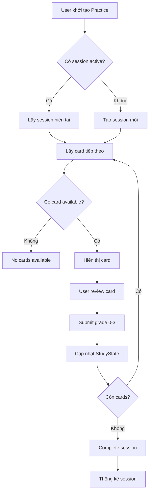
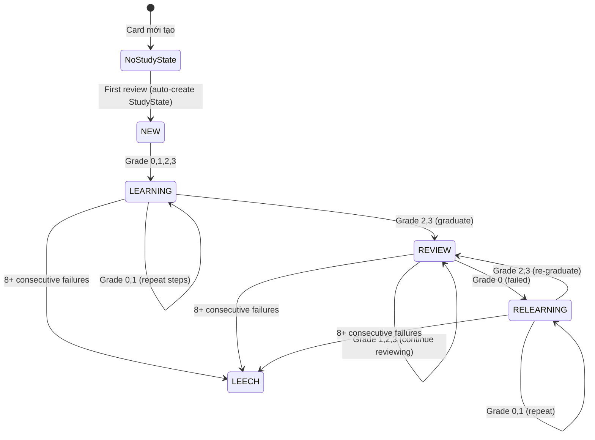
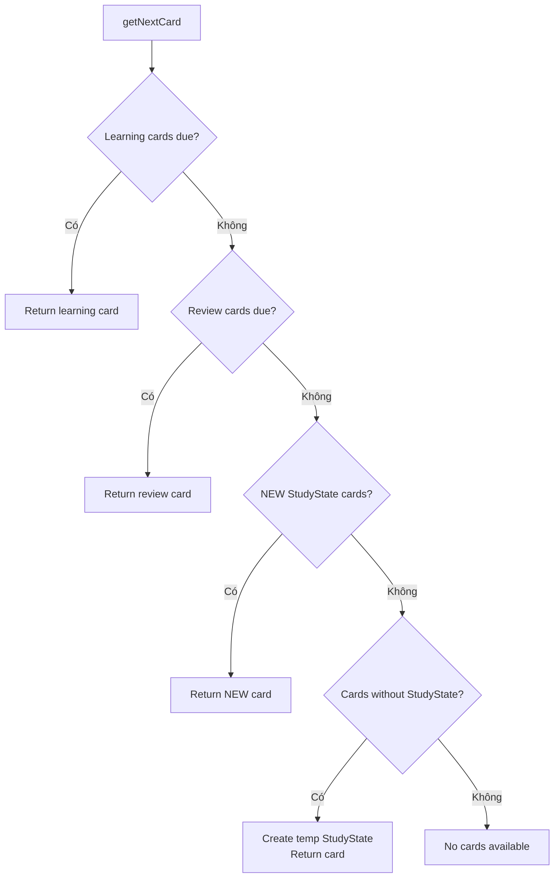
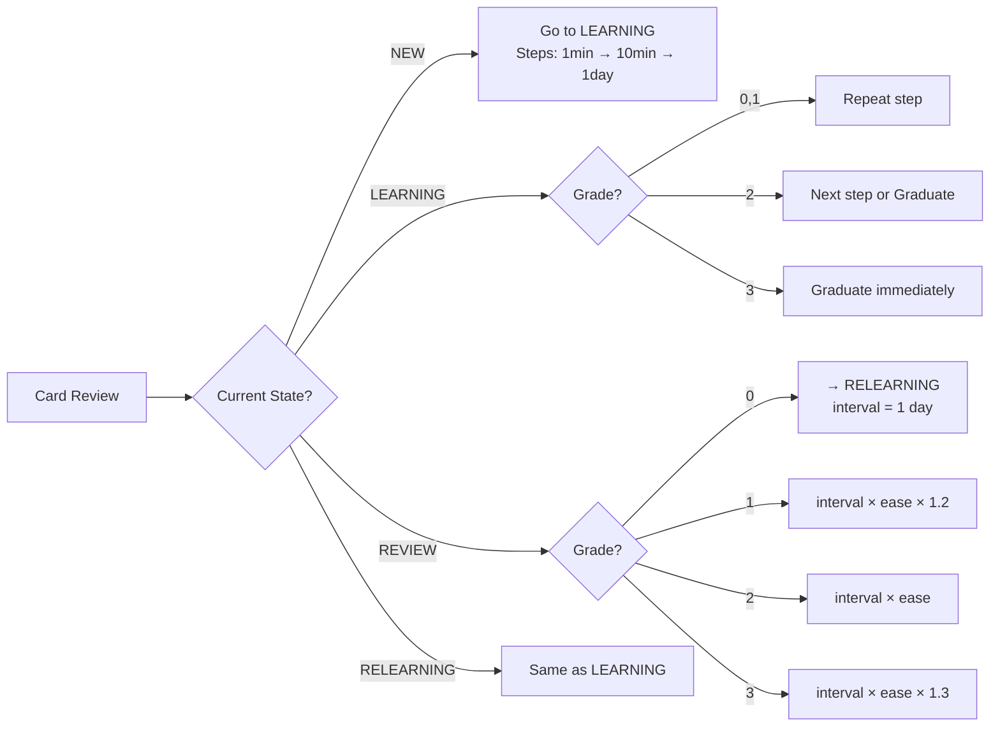

# Luồng Practice & SRS (Spaced Repetition System) - Carden API

## Tổng quan

Hệ thống học tập thông minh với thuật toán SRS dựa trên SM-2/Anki, theo dõi tiến độ và tối ưu hóa quá trình ghi nhớ. Hệ thống tự động tạo StudyState cho card mới khi được practice lần đầu.

## Workflow Cơ Bản

### 1. Bắt đầu Practice Session
**Endpoint:** `POST /v1/practice/sessions`

**Request Body:**
```json
{
  "studyMode": "FLIP",           // FLIP | TYPE_ANSWER | MULTIPLE_CHOICE  
  "deckId": 3,                   // Optional: null = all decks
  "maxNewCards": 10,             // Giới hạn card mới per session
  "maxReviewCards": 200,         // Giới hạn card review per session
  "includeNewCards": true,       // Bao gồm card mới
  "includeReviewCards": true,    // Bao gồm card cần review
  "includeLearningCards": true   // Bao gồm card đang học
}
```

### 2. Lấy Session Hiện Tại
**Endpoint:** `GET /v1/practice/sessions/current`

### 3. Lấy Card Tiếp Theo
**Endpoint:** `GET /v1/practice/next-card?deckId=3`

**Logic Ưu Tiên:**
1. **Learning cards** (due) - Card đang học và đến hạn
2. **Review cards** (due) - Card cần ôn tập  
3. **New cards** (StudyState = NEW) - Card đã có StudyState
4. **Cards without StudyState** - Card thực sự mới chưa học bao giờ

### 4. Submit Review (Đánh giá Card)
**Endpoint:** `POST /v1/practice/cards/{cardId}/review`

**Request Body:**
```json
{
  "grade": 2,                    // 0-3: Again, Hard, Good, Easy
  "responseTimeMs": 3000,        // Thời gian phản hồi
  "showAnswer": false,           // User có reveal answer sớm không
  "userAnswer": "Xin chào"       // Câu trả lời (cho TYPE_ANSWER mode)
}
```

**Grade System:**
- **0 (Again)**: Quên hoàn toàn → Reset learning, giảm ease factor
- **1 (Hard)**: Khó nhớ → Giữ learning step hoặc interval thấp  
- **2 (Good)**: Nhớ bình thường → Tiến tới step tiếp hoặc interval chuẩn
- **3 (Easy)**: Quá dễ → Graduate ngay hoặc interval dài, tăng ease factor

### 5. Hoàn Thành Session
**Endpoint:** `POST /v1/practice/sessions/{sessionId}/complete`

## Endpoints Truy Vấn

### 1. Due Cards
**Endpoint:** `GET /v1/practice/due-cards?deckId=3&page=0&size=20`

### 2. New Cards  
**Endpoint:** `GET /v1/practice/cards/new?deckId=3&page=0&size=20`

### 3. Learning Cards
**Endpoint:** `GET /v1/practice/cards/learning?deckId=3`

### 4. Due Cards Count
**Endpoint:** `GET /v1/practice/cards/due-count?deckId=3`

## Endpoints Thống Kê

### 1. User Statistics (Tổng Quan)
**Endpoint:** `GET /v1/practice/statistics`

**Thông tin trả về:**
- Total cards studied, sessions completed
- Overall accuracy, current streak  
- Card state distribution (NEW/LEARNING/REVIEW)
- Recent activity, study efficiency

### 2. Simplified Statistics (Dashboard)
**Endpoint:** `GET /v1/practice/statistics/simplified`

### 3. Deck-Specific Statistics
**Endpoint:** `GET /v1/practice/deck/{deckId}/statistics`

## SRS Algorithm Chi Tiết

### Card States
- **NEW**: Card chưa học lần nào, StudyState được tạo khi review lần đầu
- **LEARNING**: Card đang trong quá trình học (new hoặc failed)
- **REVIEW**: Card đã "graduate", ôn tập theo schedule
- **RELEARNING**: Card review bị failed, học lại

### Ease Factor (Hệ số dễ nhớ)
- **Range**: 1.3 - 3.0 (verified qua testing)
- **Initial**: 2.5 cho card mới
- **Adjustment**:
  - Grade 0: -0.2
  - Grade 1: -0.15  
  - Grade 2: Không đổi
  - Grade 3: +0.15

### Learning Steps
**Progression:** 1 phút → 10 phút → 1 ngày

- **Grade 0**: Reset về step đầu
- **Grade 1**: Lặp lại step hiện tại
- **Grade 2**: Tiến lên step tiếp theo
- **Grade 3**: Graduate ngay lập tức

### Interval Calculation

**NEW → LEARNING:**
- Bắt đầu với learning steps

**LEARNING:**
- Grade 0,1: Theo learning steps (1min, 10min)  
- Grade 2: Graduate với 1 ngày interval
- Grade 3: Graduate với 4 ngày interval

**REVIEW:**
- Grade 0: → RELEARNING, interval = 1 ngày
- Grade 1: interval × ease_factor × 1.2
- Grade 2: interval × ease_factor  
- Grade 3: interval × ease_factor × 1.3

### Leech Detection
- Card failed 8+ lần liên tiếp
- Tự động flag `isLeech = true`
- Cần xử lý đặc biệt (suspend, reset, etc.)

## Nghiệp Vụ Quan Trọng

### 1. StudyState Creation
- **Lazy Creation**: StudyState chỉ được tạo khi card được review lần đầu
- **findCardsWithoutStudyState()**: Query tìm card chưa có StudyState
- **Auto StudyState**: Tạo temporary StudyState cho cards mới trong getNextCard()

### 2. Session Management
- Chỉ 1 active session per user
- Session tracking: cards studied, accuracy, duration
- Auto-abandon after timeout (có thể configure)

### 3. Priority Algorithm
```
getNextCard() priority:
1. Learning cards (isDue = true)
2. Review cards (isDue = true)  
3. Existing NEW cards (StudyState exists)
4. Cards without StudyState (thực sự mới)
```

### 4. Interval Fuzz
- **5% randomization** để tránh synchronization
- Giúp spread review load

## Error Cases

### No Cards Available
```json
{
  "success": false,
  "message": "No cards available for practice"
}
```

### No Active Session
```json
{
  "success": false, 
  "message": "No active practice session found"
}
```

### Invalid Grade
```json
{
  "success": false,
  "message": "Grade must be between 0 and 3"
}
```

## Test Cases Đã Verify

### 1. Card Workflow
✅ NEW card → Review với grade 2 → LEARNING state  
✅ LEARNING card → Review với grade 3 → REVIEW state (graduate)  
✅ REVIEW card → Review với grade 0 → RELEARNING state

### 2. Session Flow  
✅ Start session → Practice cards → Complete session  
✅ Session statistics: accuracy, duration, card counts

### 3. Statistics
✅ User statistics: total cards, accuracy, streaks  
✅ Deck statistics: mastery, completion rates  
✅ Due cards count and distribution

### 4. Edge Cases
✅ Cards without StudyState được handle đúng  
✅ Ease factor không vượt quá 3.0  
✅ SQL recursive query hoạt động (study streak)

## Notes cho Developer

1. **Database**: StudyState table quan trọng nhất, chứa toàn bộ SRS state
2. **Performance**: Index trên (user_id, due_date) cho due cards query
3. **Migration**: V2 migration update ease_factor constraint 1.3-3.0
4. **Testing**: Đã verify end-to-end flow từ create card → practice → statistics

## Luồng Practice - Biểu Đồ Mermaid

### 1. Overall Practice Workflow


### 2. Card State Transitions


### 3. Next Card Selection Algorithm


### 4. SRS Interval Calculation


Hệ thống Practice SRS đã được test hoàn chỉnh và sẵn sàng production! 🚀