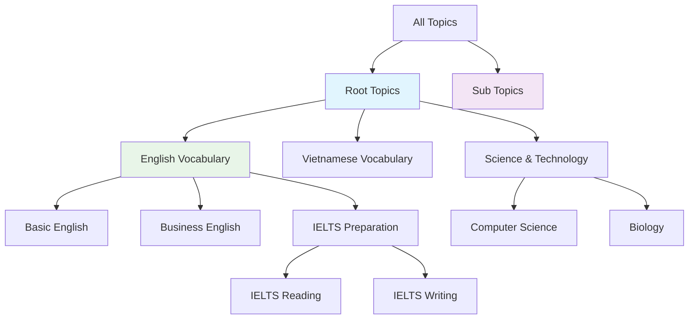

# Luồng Topic Management - Carden API

## Tổng quan

Quản lý chủ đề (topics) để phân loại và tổ chức các bộ thẻ học. Topics có thể có cấu trúc phân cấp (parent-child).

## 1. Lấy danh sách tất cả Topics

### Endpoint: `GET /v1/topics`

#### Response (200 OK):
```json
{
  "success": true,
  "data": [
    {
      "id": 1,
      "name": "English Vocabulary",
      "description": "English vocabulary topics for language learning",
      "isSystemTopic": true,
      "displayOrder": 1,
      "parentTopicId": null,
      "parentTopic": null,
      "subTopics": [
        {
          "id": 2,
          "name": "Basic English",
          "description": "Fundamental English vocabulary",
          "isSystemTopic": true,
          "displayOrder": 1,
          "parentTopicId": 1
        },
        {
          "id": 3,
          "name": "Business English",
          "description": "Professional English vocabulary",
          "isSystemTopic": true,
          "displayOrder": 2,
          "parentTopicId": 1
        }
      ],
      "deckCount": 15,
      "createdAt": "2024-01-01T00:00:00Z",
      "updatedAt": "2024-01-01T00:00:00Z"
    },
    {
      "id": 4,
      "name": "Vietnamese Vocabulary",
      "description": "Vietnamese vocabulary topics",
      "isSystemTopic": true,
      "displayOrder": 2,
      "parentTopicId": null,
      "parentTopic": null,
      "subTopics": [],
      "deckCount": 5,
      "createdAt": "2024-01-01T00:00:00Z",
      "updatedAt": "2024-01-01T00:00:00Z"
    },
    {
      "id": 5,
      "name": "IELTS Preparation",
      "description": "IELTS exam preparation materials",
      "isSystemTopic": false,
      "displayOrder": 3,
      "parentTopicId": 1,
      "parentTopic": {
        "id": 1,
        "name": "English Vocabulary"
      },
      "subTopics": [
        {
          "id": 6,
          "name": "IELTS Reading",
          "description": "Reading section vocabulary",
          "isSystemTopic": false,
          "displayOrder": 1,
          "parentTopicId": 5
        },
        {
          "id": 7,
          "name": "IELTS Writing",
          "description": "Writing section vocabulary",
          "isSystemTopic": false,
          "displayOrder": 2,
          "parentTopicId": 5
        }
      ],
      "deckCount": 8,
      "createdAt": "2024-01-05T00:00:00Z",
      "updatedAt": "2024-01-10T00:00:00Z"
    }
  ]
}
```

## 2. Topic Structure và Properties

### Topic Properties:
- **id**: ID duy nhất của topic
- **name**: Tên topic (tối đa 100 ký tự)
- **description**: Mô tả chi tiết (tối đa 500 ký tự, optional)
- **isSystemTopic**: Topic hệ thống (không thể xóa)
- **displayOrder**: Thứ tự hiển thị
- **parentTopicId**: ID của topic cha (cho hierarchy)
- **parentTopic**: Thông tin topic cha
- **subTopics**: Danh sách topics con
- **deckCount**: Số lượng decks thuộc topic này

### Hierarchy Structure:
```
English Vocabulary (id: 1)
├── Basic English (id: 2)
├── Business English (id: 3)
└── IELTS Preparation (id: 5)
    ├── IELTS Reading (id: 6)
    └── IELTS Writing (id: 7)

Vietnamese Vocabulary (id: 4)
```

## 3. Sử dụng Topics khi tạo Deck

### Trong Deck Creation:
```json
{
  "title": "IELTS Academic Vocabulary",
  "description": "Essential academic words for IELTS",
  "topicId": 6,
  "cefrLevel": "B2",
  "sourceLanguage": "en",
  "targetLanguage": "vi"
}
```

### Response với Topic Information:
```json
{
  "success": true,
  "message": "Deck created",
  "data": {
    "id": 10,
    "title": "IELTS Academic Vocabulary",
    "description": "Essential academic words for IELTS",
    "topicId": 6,
    "topic": {
      "id": 6,
      "name": "IELTS Reading",
      "description": "Reading section vocabulary",
      "parentTopic": {
        "id": 5,
        "name": "IELTS Preparation"
      }
    },
    "cefrLevel": "B2",
    "visibility": "PRIVATE",
    "createdAt": "2024-01-15T10:30:00Z"
  }
}
```

## 4. Filtering Decks by Topic

### Public Decks by Topic:
```
GET /v1/decks?topicId=1&page=0&size=10
```

### My Decks by Topic:
```
GET /v1/decks/me?topicId=5&page=0&size=10
```

### Response Example:
```json
{
  "success": true,
  "data": {
    "content": [
      {
        "id": 8,
        "title": "IELTS Reading Vocabulary",
        "description": "Key vocabulary for IELTS reading passages",
        "topicId": 6,
        "topic": {
          "id": 6,
          "name": "IELTS Reading",
          "parentTopic": {
            "id": 5,
            "name": "IELTS Preparation"
          }
        },
        "cefrLevel": "B2",
        "cardCount": 50,
        "user": {
          "id": 1,
          "username": "johndoe2024",
          "displayName": "John Doe"
        }
      }
    ],
    "totalElements": 3,
    "totalPages": 1
  }
}
```

## 5. Topic Hierarchy Queries

### Get All Root Topics (no parent):
Topics với `parentTopicId = null` sẽ là root topics.

### Get Sub-topics of a Topic:
Topics với `parentTopicId = <specific_id>` sẽ là children của topic đó.

### Breadcrumb Navigation:
```json
{
  "currentTopic": {
    "id": 6,
    "name": "IELTS Reading"
  },
  "breadcrumb": [
    {
      "id": 1,
      "name": "English Vocabulary"
    },
    {
      "id": 5,
      "name": "IELTS Preparation"
    },
    {
      "id": 6,
      "name": "IELTS Reading"
    }
  ]
}
```

## 6. Topic Usage Examples

### Example 1: Complete Topic Hierarchy
```json
{
  "id": 1,
  "name": "Language Learning",
  "isSystemTopic": true,
  "subTopics": [
    {
      "id": 2,
      "name": "English",
      "parentTopicId": 1,
      "subTopics": [
        {
          "id": 3,
          "name": "Grammar",
          "parentTopicId": 2
        },
        {
          "id": 4,
          "name": "Vocabulary",
          "parentTopicId": 2,
          "subTopics": [
            {
              "id": 5,
              "name": "Business English",
              "parentTopicId": 4
            },
            {
              "id": 6,
              "name": "Academic English",
              "parentTopicId": 4
            }
          ]
        }
      ]
    },
    {
      "id": 7,
      "name": "Vietnamese",
      "parentTopicId": 1
    }
  ]
}
```

### Example 2: Subject-based Topics
```json
[
  {
    "id": 10,
    "name": "Science & Technology",
    "isSystemTopic": true,
    "subTopics": [
      {
        "id": 11,
        "name": "Computer Science",
        "parentTopicId": 10
      },
      {
        "id": 12,
        "name": "Biology",
        "parentTopicId": 10
      },
      {
        "id": 13,
        "name": "Physics",
        "parentTopicId": 10
      }
    ]
  },
  {
    "id": 20,
    "name": "Arts & Humanities",
    "isSystemTopic": true,
    "subTopics": [
      {
        "id": 21,
        "name": "History",
        "parentTopicId": 20
      },
      {
        "id": 22,
        "name": "Literature",
        "parentTopicId": 20
      }
    ]
  }
]
```

## 7. Business Rules

### System Topics:
- **isSystemTopic = true**: Được tạo bởi admin, không thể xóa
- **isSystemTopic = false**: Được tạo bởi users, có thể xóa

### Hierarchy Rules:
- **Max Depth**: Không giới hạn độ sâu phân cấp
- **Circular Reference**: Không được phép (A → B → A)
- **Orphan Prevention**: Khi xóa parent topic, children được move lên level parent

### Display Order:
- **Root Topics**: Sắp xếp theo displayOrder
- **Sub Topics**: Sắp xếp theo displayOrder trong cùng parent
- **Default Order**: Tăng dần theo thời gian tạo

## 8. Error Responses

### 404 Not Found - Topic không tồn tại:
```json
{
  "success": false,
  "message": "Topic not found",
  "timestamp": "2024-01-15T10:30:00Z"
}
```

### 400 Bad Request - Circular reference:
```json
{
  "success": false,
  "message": "Cannot set parent topic: would create circular reference",
  "timestamp": "2024-01-15T10:30:00Z"
}
```

## 9. Test Cases cho Swagger UI

### Test Case 1: Tạo deck với root topic
```json
{
  "title": "Basic English Words",
  "description": "Fundamental English vocabulary",
  "topicId": 1,
  "cefrLevel": "A1"
}
```

### Test Case 2: Tạo deck với sub-topic
```json
{
  "title": "Business Presentations",
  "description": "Vocabulary for business presentations",
  "topicId": 3,
  "cefrLevel": "B2"
}
```

### Test Case 3: Tạo deck không có topic
```json
{
  "title": "Mixed Vocabulary",
  "description": "Various vocabulary without specific topic",
  "cefrLevel": "B1"
}
```

### Test Case 4: Search decks by topic
```
GET /v1/decks?topicId=1
GET /v1/decks?topicId=5&cefr=B2
```

## 10. Frontend Integration Tips

### Topic Selector Component:
```json
{
  "rootTopics": [
    {
      "id": 1,
      "name": "English Vocabulary",
      "children": [
        {
          "id": 2,
          "name": "Basic English",
          "children": []
        },
        {
          "id": 5,
          "name": "IELTS Preparation",
          "children": [
            {
              "id": 6,
              "name": "IELTS Reading"
            },
            {
              "id": 7,
              "name": "IELTS Writing"
            }
          ]
        }
      ]
    }
  ]
}
```

### Breadcrumb Navigation:
```javascript
const buildBreadcrumb = (topic, allTopics) => {
  const breadcrumb = [];
  let current = topic;
  
  while (current) {
    breadcrumb.unshift(current);
    current = allTopics.find(t => t.id === current.parentTopicId);
  }
  
  return breadcrumb;
};
```

### Tree Expansion State:
```javascript
const expandedTopics = {
  1: true,  // English Vocabulary expanded
  5: true,  // IELTS Preparation expanded
  4: false  // Vietnamese Vocabulary collapsed
};
```

## 11. Workflow tổng thể



## 12. Các lưu ý quan trọng

1. **Topic Hierarchy**: 
   - Hỗ trợ unlimited nesting depth
   - Self-referencing prevention
   - Orphan handling khi delete parent

2. **System vs User Topics**:
   - System topics stable và consistent
   - User topics flexible cho customization

3. **Deck Categorization**:
   - Topics optional cho decks
   - Multiple filtering options
   - Hierarchical browsing

4. **Performance Considerations**:
   - Topics được cache heavily
   - Denormalized deck counts
   - Optimized hierarchy queries

5. **Future Extensions**:
   - Topic tags/metadata
   - Topic-based recommendations
   - Advanced search filters
   - User custom topic creation
