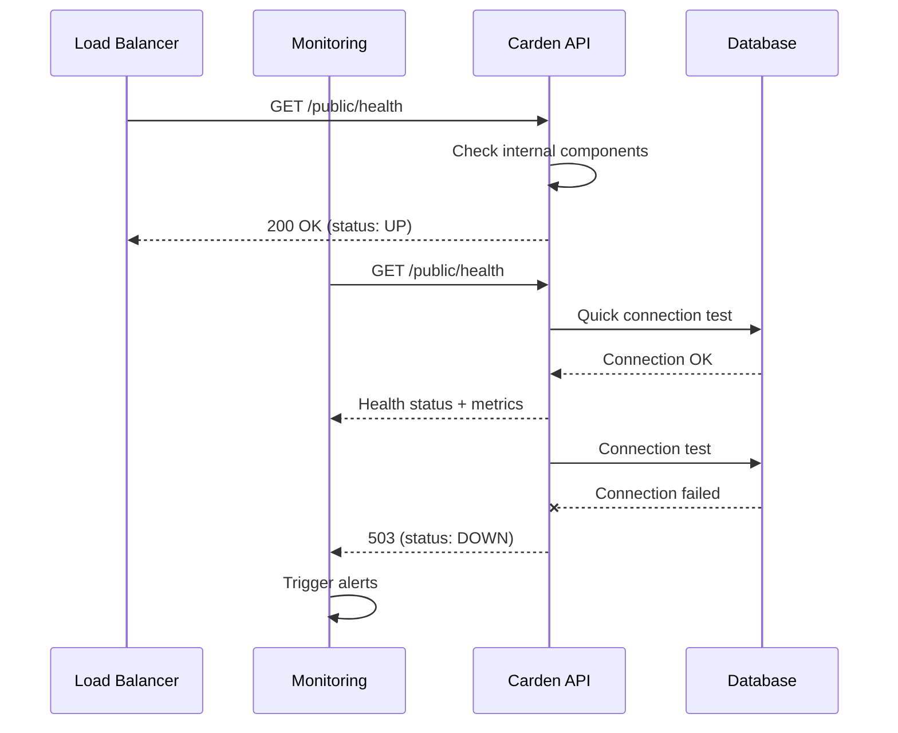

# Health Check - Carden API

## Tổng quan

Endpoint công khai để kiểm tra trạng thái hoạt động của hệ thống, không yêu cầu authentication.

## 1. Health Check

### Endpoint: `GET /public/health`

#### Response (200 OK):
```json
{
  "success": true,
  "message": "Application is healthy",
  "data": {
    "status": "UP",
    "timestamp": "2024-01-15T10:30:45.123Z",
    "version": "1.0.0",
    "service": "Carden Flashcards API"
  },
  "timestamp": "2024-01-15T10:30:45.123Z"
}
```

## 2. Health Status Information

### Status Values:
- **UP**: Hệ thống hoạt động bình thường
- **DOWN**: Hệ thống gặp sự cố
- **DEGRADED**: Hệ thống hoạt động hạn chế

### Response Fields:
- **status**: Trạng thái tổng quát của hệ thống
- **timestamp**: Thời gian kiểm tra (ISO 8601 format)
- **version**: Phiên bản hiện tại của API
- **service**: Tên service

## 3. Use Cases

### Monitoring & Alerting:
```bash
# Basic health check
curl -X GET "http://localhost:8080/public/health"

# With timeout
curl -X GET "http://localhost:8080/public/health" --max-time 5

# Check specific endpoint
curl -I "http://localhost:8080/public/health"
```

### Load Balancer Health Check:
```nginx
# Nginx upstream health check
upstream carden_api {
    server localhost:8080;
    # Health check configuration
}

location /health {
    proxy_pass http://carden_api/public/health;
    proxy_set_header Host $host;
}
```

### Docker Health Check:
```dockerfile
HEALTHCHECK --interval=30s --timeout=10s --start-period=5s --retries=3 \
  CMD curl -f http://localhost:8080/public/health || exit 1
```

## 4. Test Cases cho Swagger UI

### Test Case 1: Basic health check
```
GET /public/health
```

### Test Case 2: Health check with curl
```bash
curl -X GET "http://localhost:8080/public/health" \
  -H "Accept: application/json"
```

### Expected Response:
```json
{
  "success": true,
  "message": "Application is healthy",
  "data": {
    "status": "UP",
    "timestamp": "2024-01-15T10:30:45.123Z",
    "version": "1.0.0",
    "service": "Carden Flashcards API"
  },
  "timestamp": "2024-01-15T10:30:45.123Z"
}
```

## 5. Error Scenarios

### 503 Service Unavailable (nếu hệ thống DOWN):
```json
{
  "success": false,
  "message": "Service temporarily unavailable",
  "data": {
    "status": "DOWN",
    "timestamp": "2024-01-15T10:30:45.123Z",
    "version": "1.0.0",
    "service": "Carden Flashcards API",
    "errors": [
      "Database connection failed",
      "Redis cache unavailable"
    ]
  },
  "timestamp": "2024-01-15T10:30:45.123Z"
}
```

## 6. Monitoring Integration

### Prometheus Metrics:
```
# HELP carden_health_status Health status of Carden API
# TYPE carden_health_status gauge
carden_health_status{service="carden-api",version="1.0.0"} 1
```

### ELK Stack Logging:
```json
{
  "@timestamp": "2024-01-15T10:30:45.123Z",
  "level": "INFO",
  "service": "carden-api",
  "version": "1.0.0",
  "message": "Health check requested",
  "response_time_ms": 2,
  "status": "UP"
}
```

## 7. Security Considerations

### Rate Limiting:
- Health check endpoint có thể có rate limit riêng
- Thường cho phép tần suất cao hơn các API khác

### Information Disclosure:
- Chỉ expose thông tin cần thiết
- Không tiết lộ internal architecture details
- Version info có thể được hide trong production

## 8. Workflow tổng thể



## 9. Các lưu ý quan trọng

1. **Public Access**: 
   - Endpoint không yêu cầu authentication
   - Accessible từ bất kỳ IP nào
   - Nên có rate limiting riêng

2. **Response Time**: 
   - Health check nên response nhanh (< 1s)
   - Không thực hiện heavy operations
   - Chỉ check critical components

3. **Caching**: 
   - Health status có thể được cache ngắn hạn (5-10s)
   - Tránh overload database với health checks

4. **Logging**: 
   - Log health check requests ở DEBUG level
   - Log errors ở ERROR level
   - Tránh spam logs với frequent checks

5. **Production Deployment**:
   - Health check endpoint luôn available
   - Used by container orchestration
   - Critical for zero-downtime deployments
