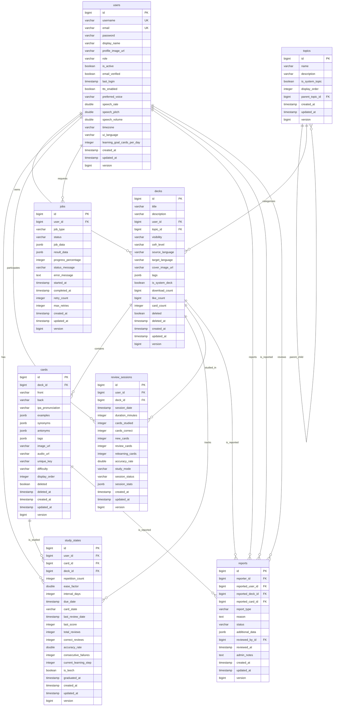

# Sơ đồ quan hệ thực thể (ERD) - Carden Database

## Sơ đồ tổng quan

## Mô tả các mối quan hệ

### 1. User - Deck (1:N)
- **Mối quan hệ**: Một user có thể tạo nhiều deck
- **Foreign Key**: `decks.user_id -> users.id`
- **Ràng buộc**: NOT NULL (deck phải có owner)
- **Cascade**: Khi user bị xóa, các deck của user sẽ được xử lý theo business rule

### 2. Topic - Topic (1:N) - Self Reference
- **Mối quan hệ**: Một topic có thể có nhiều sub-topics
- **Foreign Key**: `topics.parent_topic_id -> topics.id`
- **Ràng buộc**: NULLABLE (topic gốc không có parent)
- **Cascade**: Khi parent topic bị xóa, sub-topics có thể được reassign hoặc xóa

### 3. Topic - Deck (1:N)
- **Mối quan hệ**: Một topic có thể chứa nhiều deck
- **Foreign Key**: `decks.topic_id -> topics.id`
- **Ràng buộc**: NULLABLE (deck có thể không có topic)
- **Cascade**: Khi topic bị xóa, deck vẫn tồn tại với topic_id = NULL
- **Visibility**: Deck có thể có visibility PRIVATE, PUBLIC, hoặc UNLISTED

### 4. Deck - Card (1:N)
- **Mối quan hệ**: Một deck chứa nhiều card
- **Foreign Key**: `cards.deck_id -> decks.id`
- **Ràng buộc**: NOT NULL (card phải thuộc về một deck)
- **Cascade**: Khi deck bị soft delete, cards cũng bị soft delete

### 5. User - StudyState (1:N)
- **Mối quan hệ**: Một user có nhiều study state cho các cards khác nhau
- **Foreign Key**: `study_states.user_id -> users.id`
- **Ràng buộc**: NOT NULL
- **Unique Constraint**: (user_id, card_id) - mỗi user chỉ có 1 study state per card

### 6. Card - StudyState (1:N)
- **Mối quan hệ**: Một card có nhiều study state từ các users khác nhau
- **Foreign Key**: `study_states.card_id -> cards.id`
- **Ràng buộc**: NOT NULL
- **Business Rule**: Study state chỉ tồn tại khi user đã học card đó

### 7. Deck - StudyState (1:N)
- **Mối quan hệ**: Để denormalize và tối ưu queries
- **Foreign Key**: `study_states.deck_id -> decks.id`
- **Ràng buộc**: NOT NULL
- **Consistency**: Phải match với deck_id của card tương ứng

### 8. User - ReviewSession (1:N)
- **Mối quan hệ**: Một user có nhiều review sessions
- **Foreign Key**: `review_sessions.user_id -> users.id`
- **Ràng buộc**: NOT NULL
- **Timeline**: Ordered by session_date cho historical tracking

### 9. Deck - ReviewSession (1:N)
- **Mối quan hệ**: Một deck có thể được study trong nhiều sessions
- **Foreign Key**: `review_sessions.deck_id -> decks.id`
- **Ràng buộc**: NULLABLE (mixed-deck sessions)
- **Analytics**: Cho deck-specific performance tracking

### 10. User - Job (1:N)
- **Mối quan hệ**: Một user có thể có nhiều background jobs
- **Foreign Key**: `jobs.user_id -> users.id`
- **Ràng buộc**: NOT NULL
- **Queue**: Jobs được process theo creation order và priority

### 11. User - Report (1:N) - Reporter
- **Mối quan hệ**: Một user có thể tạo nhiều reports
- **Foreign Key**: `reports.reporter_id -> users.id`
- **Ràng buộc**: NOT NULL
- **Business Rule**: User không thể report chính mình

### 12. User - Report (1:N) - Reported User
- **Mối quan hệ**: Một user có thể bị nhiều users report
- **Foreign Key**: `reports.reported_user_id -> users.id`
- **Ràng buộc**: NULLABLE
- **Conflict**: Check constraint để ensure reporter != reported_user

### 13. User - Report (1:N) - Reviewer
- **Mối quan hệ**: Một admin user có thể review nhiều reports
- **Foreign Key**: `reports.reviewed_by_id -> users.id`
- **Ràng buộc**: NULLABLE (pending reports)
- **Authorization**: Chỉ ADMIN role mới có thể review

### 14. Deck - Report (1:N)
- **Mối quan hệ**: Một deck có thể bị report nhiều lần
- **Foreign Key**: `reports.reported_deck_id -> decks.id`
- **Ràng buộc**: NULLABLE
- **Business Rule**: Chỉ public decks mới có thể bị report

### 15. Card - Report (1:N)
- **Mối quan hệ**: Một card có thể bị report về nội dung không phù hợp
- **Foreign Key**: `reports.reported_card_id -> cards.id`
- **Ràng buộc**: NULLABLE
- **Context**: Report card thường đi kèm với deck context

## Ràng buộc toàn vẹn dữ liệu

### Check Constraints
- **users.role**: IN ('USER', 'ADMIN')
- **decks.visibility**: IN ('PRIVATE', 'PUBLIC', 'UNLISTED')
- **decks.cefr_level**: IN ('A1', 'A2', 'B1', 'B2', 'C1', 'C2')
- **cards.difficulty**: IN ('EASY', 'NORMAL', 'HARD')
- **study_states.ease_factor**: BETWEEN 1.3 AND 3.0
- **study_states.card_state**: IN ('NEW', 'LEARNING', 'REVIEW', 'RELEARNING')
- **review_sessions.study_mode**: IN ('FLIP', 'TYPE_ANSWER', 'MULTIPLE_CHOICE')
- **review_sessions.session_status**: IN ('IN_PROGRESS', 'COMPLETED', 'ABANDONED')
- **jobs.status**: IN ('PENDING', 'RUNNING', 'COMPLETED', 'FAILED', 'CANCELLED')
- **reports.report_type**: IN ('INAPPROPRIATE_CONTENT', 'COPYRIGHT_VIOLATION', 'SPAM', 'HARASSMENT', 'MISINFORMATION', 'OTHER')
- **reports.status**: IN ('PENDING', 'UNDER_REVIEW', 'RESOLVED', 'DISMISSED')

### Unique Constraints
- **users**: (username), (email)
- **study_states**: (user_id, card_id)

---

*Sơ đồ này được generate từ database schema V1 và sẽ được cập nhật theo các migrations tiếp theo*
